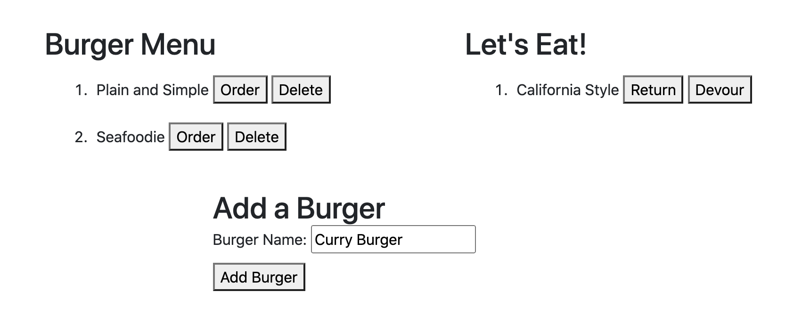

  # Virtual Burgers
  
  ## Description
  Virtual Burgers is a restaurant app that allows the user to choose one or more specialty burgers from the menu options. After selecting a burger name, the burger will move to the left "Let's Eat!" side, ready to be "devoured." The user may also input any unique (or not) burger name to be added to the menu.
  
  ##Deployed on Heroku
  http://virtual-burgers.herokuapp.com/

  ## Contributing
  
  Languages and Frameworks Used: JavaScript, Node.js, jQuery, MYSQL, Bootstrap, Handlebars
  
  ## Questions
  
  Please contact [sharlenemay](https://github.com/sharlenemay) at sharleneminosa@gmail.com for questions. 
